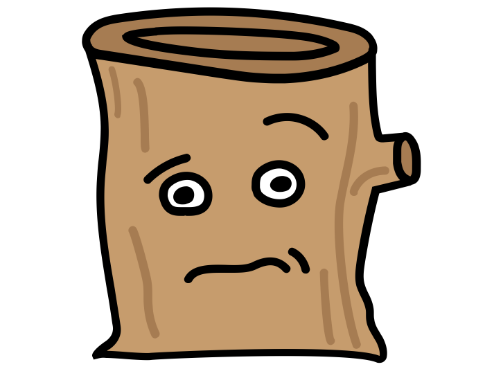

# 

[][travis]
[][godocs]

[travis]: https://travis-ci.org/alexanderGugel/taker
[godocs]: https://godoc.org/github.com/alexanderGugel/taker

**taker** provides simple, modular functions for working with asynchronous Golang code.

## Why?

Do you often find yourself writing repetitive error handling checks in Go?

```go
if err := wakeUp(); err != nil {
  return err
}
if err := boilWater(); err != nil {
  return err
}
if err := makeSandwich(); err != nil {
  return err
}
if err := brushTeeth(); err != nil {
  return err
}
```

Doesn't this kind of code just make you want to use promises, `try` / `catch`
or something like [`async`](http://caolan.github.io/async/)?

Fear no more! **taker** allows you to get rid of the redundant error handling
by providing a set of common utility functions used for dealing with asynchronous code.

In the above example, we could wrap our imperative functions into smaller tasks
and chain them using `Series` (each of the above functions would return a
task):

```go
return taker.Series(
  taker.Wrap(wakeUp),
  taker.Wrap(boilWater),
  taker.Wrap(makeSandwich),
  taker.Wrap(brushTeeth),
)
```

**taker** is based on the idea of "tasks". A task has to implement a `Run() error` method. Instead of implementing our own tasks, we can also wrap preexisting, functions into tasks using `taker.Wrap(myFunc)` where `myFunc` implements `func() error`.

For detailed docs, see [Godocs](https://godoc.org/github.com/alexanderGugel/taker).

## Install

Using `go get`:

```
$ go get github.com/alexanderGugel/taker
```

## Dependencies

**taker** currently uses [govendor](https://github.com/kardianos/govendor) for vendoring dependencies.

## Credits

* [Stumped](https://thenounproject.com/Mattebrooks/collection/objecticons/?i=63913) by Nick Abrams from the Noun Project

## License

[MIT](LICENSE)
